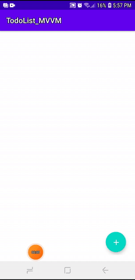
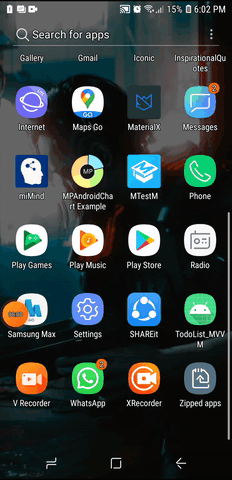

#TODO app

This is a simple TODO app that implements the MVVM architectural pattern. A SQlite database was used as the backend datasource
to store and maintain task data.

A recyclview was used to display a list of tasks that was recently
added by the user, which are organized vertically.

Users are given the option to add, modify, and delete tasks from
the main activity as shown in the gif above.

#Deleting tasks

Tasks can be deleted by swiping it out of the screen
